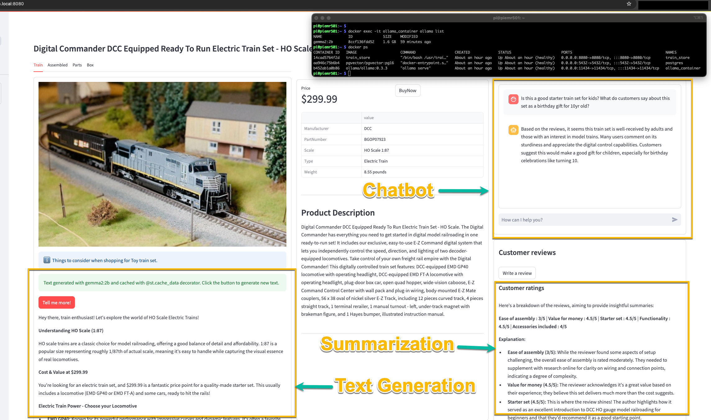

# train-store
Online Train store with AI shopping assistant

# Steps to setup up Local dev environment

> [!Note] This was our submission for Stanford University **tech16-llm4biz-summer24** *Large Language Models for business with python* final project.

## Recommended hardware
||**Device**|**Recommended Config**|
|-|-|-|
|1.|Linux Host|Ubuntu 22.04|
|2.|CPU|4 cores or more|
|3.|Memory|16GB or more|
|4.|Storage|128GB or more|
|5.|GPU (optional)|12GB VRAM or more (eg. RTX3060)|


## Running Gemma2:2b and Llama3.1:8b models using Ollama

1. Verify docker service is running.
   ```bash
   docker info
   ```
2. Clone this repository and start docker containers
   ```
   git clone https://github.com/chaudhariatul/train-store
   cd train-store
   docker-compose up -d
   ```
3. Adjust the `cpus: 8` and reduce to 6 or 4 if you are running on a host with less resources. Downloading all the docker container images, setting up database and the Language Models could take more than 15mins to complete. Open `http://<machine-ip>:8080` in a browser to verify all the containers have started successfully.
4. Add sample reviews for this demo once the website on port 8080 is ready.
   ```
   docker exec -it train_store bash -c "cd /usr/train_store/ && python add_reviews.py"
   ```
5. Create new reviews, ask questions and if you run into issue create a github issue!

> [!NOTE]
> Increase swap on your machine and use a NVMe drive to get better performance.

---

When running on a Raspberry Pi 5 with 8GB RAM with docker installed you can run this command to automate installation:

```bash
curl -sSl https://raw.githubusercontent.com/chaudhariatul/train-store/main/setup_train_store_demo.sh | bash
```

---

